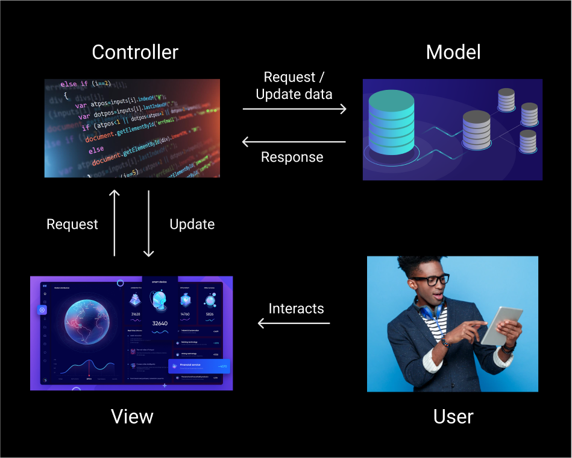

# Investigation

Now you must investigate and answer the questions that are proposed below:

## What is an architecture pattern?

An architectural pattern is a general, reusable solution to a commonly occurring problem in software architecture within a given context.

## What is the MVC pattern?

Model–view–controller (usually known as MVC) is a software design pattern commonly used for developing user interfaces that divides the related program logic into three interconnected elements. This is done to separate internal representations of information from the ways information is presented to and accepted from the user.
 
### Model
The central component of the pattern. It directly manages the data, logic and rules of the application. It receives user input from the controller.
### View
Any representation of information such as a chart, diagram or table. Multiple views of the same information are possible.
### Controller
Accepts input and converts it to commands for the model or view. The controller receives the input, optionally validates it and then passes the input to the model.

## Draw a scheme where you understand that the MVC pattern is clearly

## Explain in which cases you would use this pattern

I would use it in web and mobile applications or any other program that needs a graphical user interface.

## Describe step by step what happens in this pattern from when you create a Request until a Response is returned (you can give more than one example if you consider it necessary).

First of all a view is shown and the user interacts with it. The view sends this interaction to the controller that validates it if is necessary and sends the correct request to the model. The model gets or modifies the necessary data and returns a response to the controller that sends the response with the necessary information to the view.

## What advantages do you think this pattern has to use?

Is a general solution to build graphical user interfaces and separates all the logics on how the data is stored and how this data is represented. 

